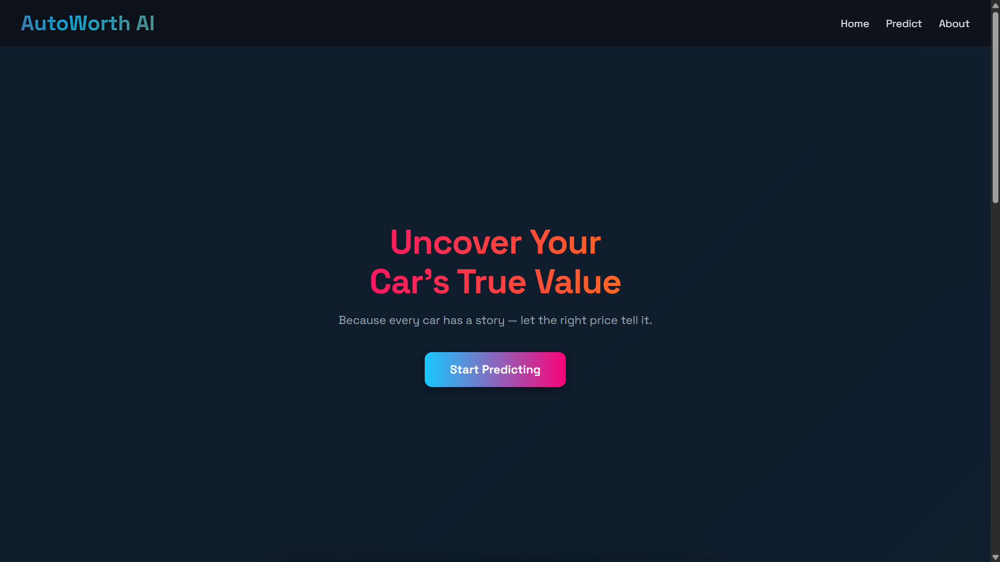
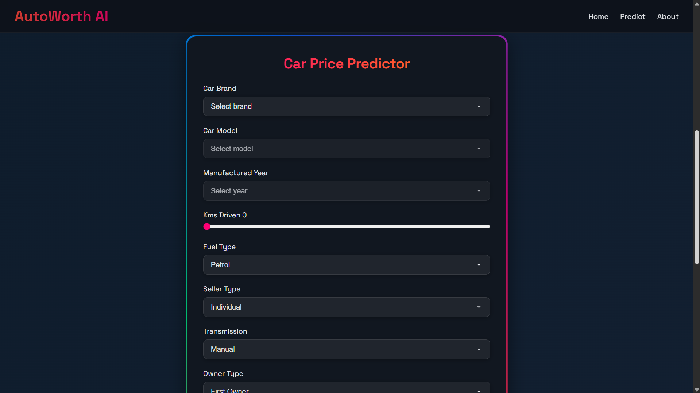
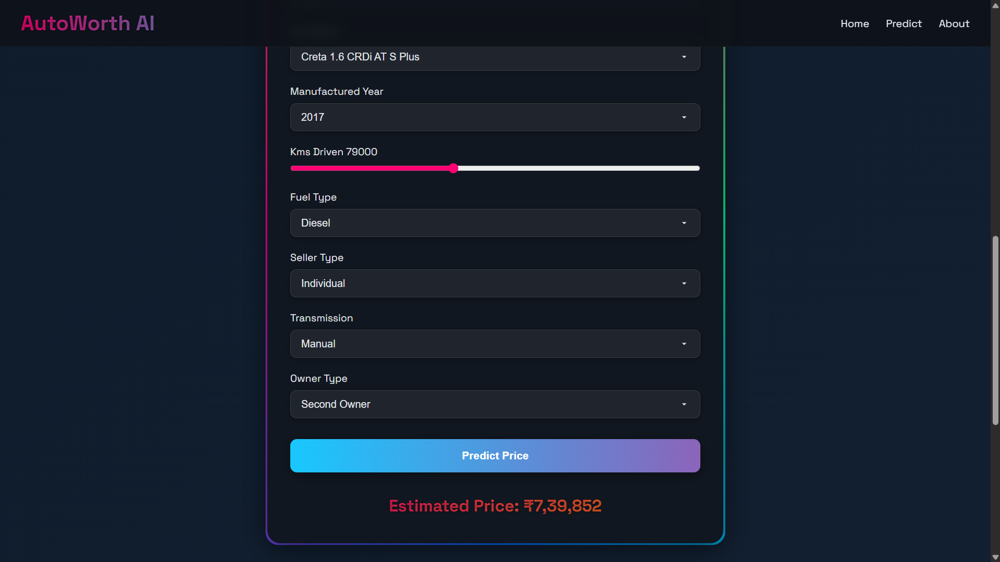
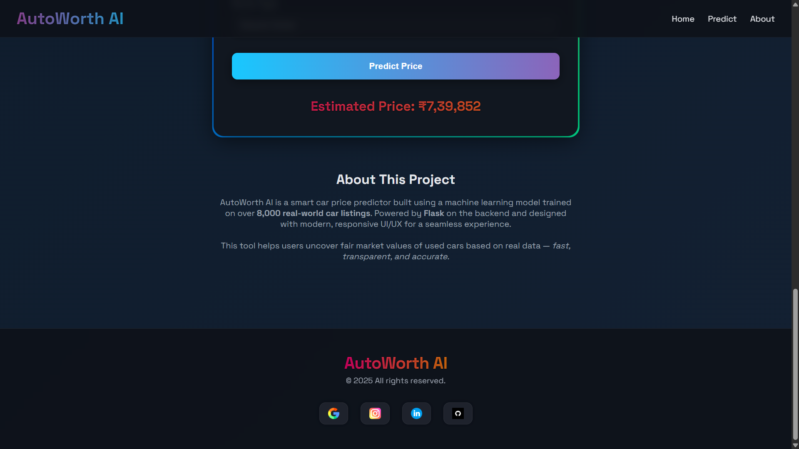
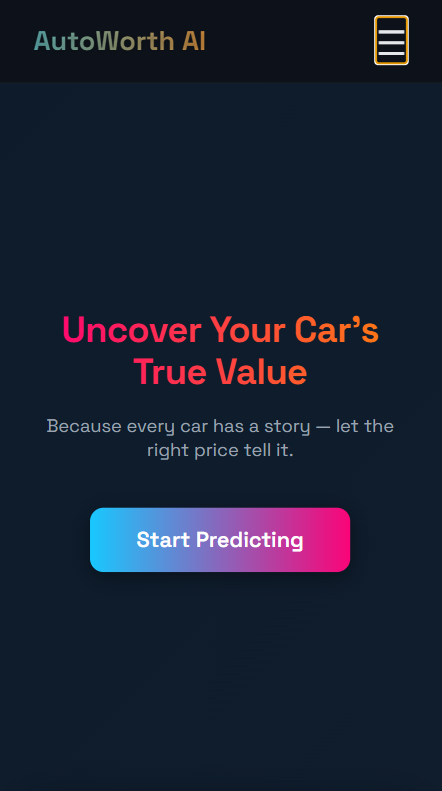
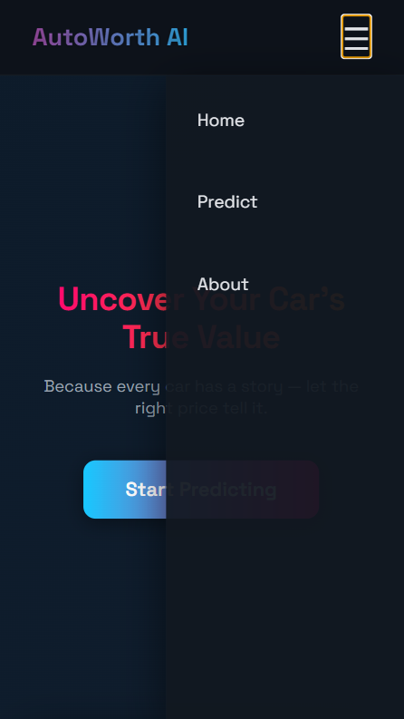
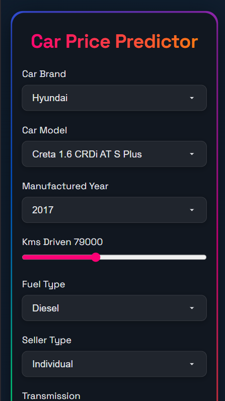
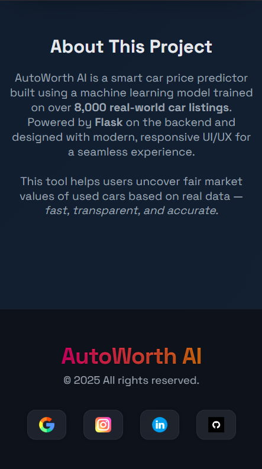

# AutoWorth-AI
# 🚗 AutoWorth AI – Car Price Predictor

AutoWorth AI is an intelligent, web-based car price prediction app built using **Flask**, **machine learning**, and a clean, responsive frontend. Users can easily get an estimated resale value of a car by selecting the brand, model, year, and other attributes.

> ✅ Trained on 8,000+ real car listings
> ✅ Uses a trained ML model built with scikit-learn
> ✅ Designed with mobile-friendly modern UI

---

# ✨ Highlights

* 🔮 Real-time Car Price Prediction
* 📊 Dynamic Dropdowns: Brand → Model → Year
* 📱 Fully Responsive on Mobile & Desktop
* 🎨 Clean UI with gradient animations
* ⚡ KM-driven slider with live value

---

# 🖼️ Screenshots


### 🖥️ Desktop View

#### Home Page


#### Form Page


#### Prediction Result


#### Footer


---

### 📱 Mobile View

#### Mobile Home


#### Mobile Navbar


#### Mobile Form


#### Mobile Footer



---

# 🧠 How It Works

1. User selects a brand → model → year from dynamic dropdowns
2. Enters additional details like fuel, transmission, owner, etc.
3. The form data is sent to a Flask API
4. Backend uses a trained ML model (`car_model.pkl`) to predict
5. Result is shown in the frontend

---

# 📁 Folder Structure

```
CAR PRICE/
├── static/                # CSS + JS files
│   ├── style.css
│   └── script.js
│
├── templates/
│   └── index.html         # Main UI Page
│
├── Model/
│   └── car_model.pkl      # Trained ML Model
│
├── screenshots/           # README screenshots
│   └── *.png
│
├── Cardetails.csv         # Dataset
├── app.py                 # Flask backend
├── requirements.txt       # All dependencies
└── README.md
```

---

# 🧪 Tech Stack

* **Frontend:** HTML5, CSS3, JS
* **Backend:** Python Flask
* **Model:** scikit-learn, joblib
* **Data:** Custom dataset of car listings

---

# 🛠️ Local Setup Instructions

### 1. Clone the Repository

```bash
git clone https://github.com/your-username/car-price-predictor.git
cd car-price-predictor
```

### 2. Install Requirements

```bash
pip install -r requirements.txt
```

### 3. Run the App

```bash
python app.py
```

Visit `http://127.0.0.1:10000/` in your browser.

---


# 🙋‍♂️ Contact

**Yatharth**
📬 [LinkedIn](https://www.linkedin.com/in/yatharth-59aa49328)
🐱 [GitHub](https://github.com/01-YATHARTH)
📩 [Feedback Form](https://docs.google.com/forms/d/e/1FAIpQLSfzOmo4NxwW8NqatCycnOpejFBoFt2IxY4mojyT_Pif1KAo2Q/viewform?usp=sharing)

---
